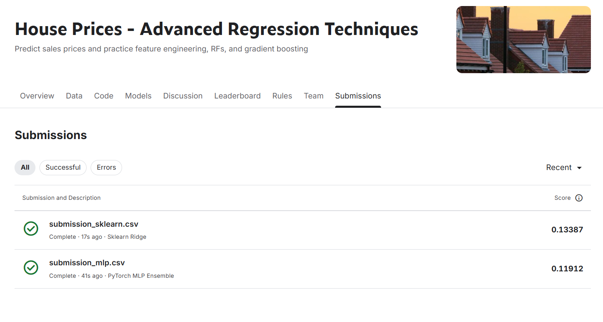

# TRƯỜNG ĐẠI HỌC SÀI GÒN (SGU)
## KHOA CÔNG NGHỆ THÔNG TIN
### BỘ MÔN: HỌC SÂU (DEEP LEARNING)

---

# BÁO CÁO BÀI TẬP LỚN / LAB 03
## ĐỀ TÀI: DỰ ĐOÁN GIÁ BÁN NHÀ (HOUSE PRICES - ADVANCED REGRESSION TECHNIQUES)
### NGHIÊN CỨU THỰC NGHIỆM ĐẶC TRƯNG VÀ SO SÁNH SCIKIT-LEARN VỚI PYTORCH MLP

---

### THÔNG TIN NHÓM THỰC HIỆN: 

| STT | Họ và tên thành viên | Mã số sinh viên  | Vai trò | Tỷ lệ đóng góp |
| :---: | :--- | :---: | :---: | :--- | :---: |
| 1 | **Bùi Đức Trường** | **3123411319**  | **Nhóm trưởng** | 100% |
| 2 | **Nguyễn Thị Ánh Trâm** | ***3123411306*** |  Thành viên | 100% |
| 3 | **Nguyễn Thị Ngọc Trúc** | ***3123411313*** | Thành viên | 100% |
| 4 | **Lê Thị Thanh Tuyền** | ***3123411332*** | Thành viên | 100% |

- **Giảng viên hướng dẫn:** Đỗ Như Tài
- **Năm học:** 2026 - 2027

---

## BẢNG PHÂN CÔNG CÔNG VIỆC VÀ SẢN PHẨM HOÀN THÀNH

| Thành viên | Nhiệm vụ kỹ thuật phụ trách | Sản phẩm mã nguồn nộp | Phần viết báo cáo |
| :--- | :--- | :--- | :--- |
| **Bùi Đức Trường** *(Trưởng nhóm)* | • Nghiên cứu paper Dean De Cock (2011), xác định bài toán & metric RMSLE. • Phân tích EDA phân phối giá, phát hiện ngoại lai $GrLivArea > 4000$. • Thiết lập Pipeline chung & bộ chia 5-Fold Cross Validation không rò rỉ. • Thực hiện kiểm chứng Model Check tính tay độc lập (Hình 2 paper). • Tích hợp toàn bộ dự án, quản lý kiểm thử và hoàn thiện bài nộp. | • `notebooks/01_eda_and_problem_definition.ipynb` • `src/preprocess.py` • `src/model_check.py` • 5 biểu đồ EDA trong `figures/` | • Trang bìa & Bảng phân công • Chương 1: Giới thiệu đề tài • Chương 2: Phân tích bài toán & EDA • Chương 6: Model Check & Kết luận |
| **Nguyễn Thị Ánh Trâm** | • Xây dựng mô hình Machine Learning chuẩn bằng Scikit-learn (Ridge Regression). • Tinh chỉnh siêu tham số (`alpha`, `solver`) bằng `RandomizedSearchCV` 5-Fold CV. • Chạy thực nghiệm qua các gói đặc trưng (EXP-00 $\to$ EXP-04). • Kiểm chứng sự sụt giảm sai số khi loại bỏ ngoại lai theo paper De Cock. • Xuất file dự đoán Kaggle Scikit-learn. | • `notebooks/02_sklearn_baseline.ipynb` • `notebooks/03_sklearn_tuning.ipynb` • `submissions/submission_sklearn.csv` | • Chương 3: Xây dựng mô hình Machine Learning bằng Scikit-learn |
| **Nguyễn Thị Ngọc Trúc** | • Chuyển đổi mô hình ANN Keras mẫu sang mạng Deep Learning PyTorch MLP thuần túy. • Thiết kế kiến trúc sâu (Linear $\to$ BatchNorm1d $\to$ ReLU $\to$ Dropout). • Viết Training Loop chuẩn, AdamW, Cosine LR Scheduler, Early Stopping. • Phân tích bóc tách siêu tham số (Ablation Study) và chẩn đoán phần dư 4-in-1. • Xuất file dự đoán Kaggle PyTorch MLP. | • `notebooks/04_pytorch_mlp.ipynb` • `src/mlp_model.py`, `train_mlp.py` • `models/mlp_model.pt` • `submissions/submission_mlp.csv` | • Chương 4: Xây dựng mô hình Deep Learning MLP bằng PyTorch |
| **Lê Thị Thanh Tuyền** | • Phân tích tương quan các nhóm thuộc tính vật lý và Random Forest Importance. • Lập trình tạo 6 đặc trưng kỹ thuật mới (`TotalSF`, `TotalBathrooms`, `TotalPorchSF`, `HouseAge`, `RemodAge`, `GarageAge`). • Thiết kế Feature Selection (19 đặc trưng quan trọng nhất cho EXP-04). • Thiết kế và quản lý quy chuẩn 5 gói thực nghiệm (Protocol). | • `notebooks/05_feature_engineering.ipynb` • `src/feature_engineering.py` • 6 biểu đồ đặc trưng trong `figures/` • 8 file protocol trong `results/` | • Chương 5: Feature Engineering và Kết quả thực nghiệm đối sánh |

---

# CHƯƠNG 1: GIỚI THIỆU BÀI TOÁN & MỤC TIÊU NGHIÊN CỨU
*Người phụ trách: Bùi Đức Trường*

### 1.1. Bối cảnh đề tài
Định giá bất động sản là bài toán thực tiễn quan trọng bậc nhất trong kinh tế lượng và thị trường tài chính. Giá trị của một ngôi nhà phụ thuộc vào sự tương tác phức tạp của hàng chục yếu tố: vị trí, diện tích sàn, chất lượng hoàn thiện công trình, tuổi thọ sử dụng, tiện nghi phụ trợ (gara, tầng hầm, ban công, hiên nhà).

Cuộc thi **"House Prices: Advanced Regression Techniques"** trên Kaggle cung cấp tập dữ liệu thực tế gồm 79 biến giải thích mô tả các ngôi nhà dân cư tại thành phố Ames, Iowa (Hoa Kỳ). Nhiệm vụ của nhóm là xây dựng các mô hình học máy (Machine Learning) và học sâu (Deep Learning) nhằm dự đoán giá bán nhà (`SalePrice`).

### 1.2. Mục tiêu cụ thể của đồ án
1. **Nghiên cứu khoa học:** Khảo sát bài báo gốc của Dean De Cock (2011) để nắm bắt bản chất các loại biến và các hiện tượng thống kê đặc thù (ngoại lai, phương sai không đồng nhất).
2. **Xây dựng mô hình Machine Learning (Scikit-learn):** Thiết kế pipeline chuẩn hóa, hồi quy tuyến tính có chính quy hóa (Ridge Regression) kết hợp dò tìm siêu tham số tối ưu.
3. **Xây dựng mô hình Deep Learning (PyTorch MLP):** Nâng cấp kiến trúc ANN Keras sang mạng nơ-ron nhiều lớp PyTorch, ứng dụng BatchNorm, Dropout, Weight Decay và Cosine Scheduler nhằm kiểm soát Overfitting trên dữ liệu dạng bảng.
4. **Nghiên cứu Kỹ thuật Đặc trưng (Feature Engineering):** Đề xuất 6 biến phái sinh mới và thiết kế chuỗi 5 thực nghiệm có kiểm soát (EXP-00 $\to$ EXP-04) trên cùng một bộ chia 5-Fold Cross Validation không rò rỉ dữ liệu.
5. **Kiểm chứng tính toán thủ công (Model Check):** Thực hiện tính tay một quan sát độc lập theo Hình 2 của paper De Cock để kiểm tra độ tin cậy tuyệt đối của mã nguồn.

---

# CHƯƠNG 2: CƠ SỞ LÝ THUYẾT PAPER DEAN DE COCK (2011) & PHÂN TÍCH DỮ LIỆU (EDA)
*Người phụ trách: Bùi Đức Trường*

### 2.1. Đóng góp của Paper Dean De Cock (2011)
Bài báo *"Ames, Iowa: Alternative to the Boston Housing Data as an End of Semester Regression Project"* (Journal of Statistics Education) giới thiệu bộ dữ liệu 2.930 quan sát với 80 biến, chia làm 4 nhóm:
- 20 biến liên tục (diện tích các tầng, tầng hầm, hiên nhà).
- 14 biến rời rạc (số lượng phòng, số xe gara, năm xây dựng).
- 23 biến định danh (loại nhà, khu phố, kiểu móng).
- 23 biến thứ bậc (thang đo chất lượng và tình trạng từ Poor đến Excellent).

### 2.2. Xử lý ngoại lai (Outliers) theo bài báo
Tại mục *Potential Pitfalls (trang 4)*, De Cock khuyến nghị:
> *"Có 5 quan sát nên loại bỏ trước khi xây dựng mô hình (biểu đồ SalePrice theo GrLivArea sẽ làm lộ các điểm này). Trong đó có 3 ngoại lai thực sự (bán một phần - Partial Sales không phản ánh giá thị trường) và 2 căn nhà cực lớn. Tôi khuyến nghị loại bỏ các căn nhà có diện tích GrLivArea > 4000 sq ft."*

Trên tập train Kaggle (1460 căn), nhóm đã phát hiện và loại bỏ 2 điểm ngoại lai cực đoan:
- **Id 524:** $GrLivArea = 4676\text{ sq ft}$, giá bán chỉ $\$184,750$ (Partial Sale).
- **Id 1299:** $GrLivArea = 5642\text{ sq ft}$, giá bán chỉ $\$160,000$ (Partial Sale).
Việc loại bỏ 2 quan sát này giúp bảo vệ đường hồi quy không bị lệch lạc (chi tiết xem tại Hình `figures/02_outliers_grlivarea.png`).

### 2.3. Cơ sở toán học của biến đổi Logarit $y = \log(1 + \text{SalePrice})$
Giá nhà gốc có độ xiên rất cao (**Skewness = 1.88**). Hơn nữa, thước đo chính thức của cuộc thi Kaggle là **RMSLE**:
$$\text{RMSLE} = \sqrt{\frac{1}{n} \sum_{i=1}^{n} (\log(p_i + 1) - \log(y_i + 1))^2}$$
Khi chuyển đổi mục tiêu sang $y_{log} = \text{log1p}(\text{SalePrice})$, độ xiên giảm xuống chỉ còn **0.12** (xấp xỉ phân phối chuẩn Gauss), và hàm mất mát MSE trên $y_{log}$ hoàn toàn tương đương với RMSLE trên giá gốc.

### 2.4. Khảo sát dữ liệu thiếu & Quy tắc Chống rò rỉ (No Data Leakage)
- Bốn cột có tỷ lệ thiếu $> 80\%$ (`PoolQC`, `MiscFeature`, `Alley`, `Fence`) được loại bỏ vì không đủ mẫu đại diện.
- Các cột tiện ích bị thiếu được điền nhãn `"None"` vì ký hiệu `NA` trong bài báo có nghĩa là "ngôi nhà không có hạng mục đó" (không có gara, không có tầng hầm).
- Mọi phép tiền xử lý (`SimpleImputer`, `StandardScaler`, `OneHotEncoder`) đều chỉ được `fit` trên tập Training Fold của từng vòng lặp Cross-Validation.

---

# CHƯƠNG 3: MÔ HÌNH MACHINE LEARNING BẰNG SCIKIT-LEARN
*Người phụ trách: Nguyễn Thị Ánh Trâm*

### 3.1. Thiết kế mô hình & Pipeline
Nhóm chọn **Ridge Regression (Chính quy hóa L2)** làm mô hình chuẩn. Với dữ liệu bảng sau mã hóa One-Hot (mở rộng lên hơn 250 chiều), Ridge kiểm soát đa cộng tuyến và chống overfitting cực tốt:
$$\mathcal{L}_{Ridge} = \frac{1}{n} \sum_{i=1}^{n} (y_i - \hat{y}_i)^2 + \alpha \sum_{j=1}^{p} w_j^2$$

### 3.2. Tinh chỉnh Siêu tham số (Hyperparameter Tuning)
Bằng phương pháp `RandomizedSearchCV` (5-Fold CV), nhóm đã tìm ra bộ tham số tối ưu:
$$\text{Best Params} = \{\text{'model\_\_alpha'}: 10.0,\ \text{'model\_\_solver'}: \text{'saga'}\}$$

### 3.3. Bảng Kết quả Thực nghiệm Scikit-Learn (5-Fold Cross Validation)

| Thực nghiệm | Đặc trưng bổ sung | Số chiều | Mean RMSLE | Std RMSLE | Mean MAE ($) |
| :--- | :--- | :---: | :---: | :---: | :---: |
| **EXP-00** | Dữ liệu gốc sau tiền xử lý | 288 | 0.11450 | 0.00778 | $13,747.46 |
| **EXP-01** | EXP-00 + `TotalSF` | 289 | 0.11450 | 0.00778 | **$13,745.40** |
| **EXP-02** | EXP-01 + `TotalBathrooms` + `TotalPorchSF` | 291 | 0.11450 | 0.00778 | $13,746.29 |
| **EXP-03** | EXP-02 + `HouseAge` + `RemodAge` + `GarageAge` | 294 | 0.11452 | 0.00781 | $13,747.57 |
| **EXP-04** | 19 Đặc trưng chọn lọc từ Random Forest | 204 | 0.13057 | 0.01030 | $16,396.58 |

### 3.4. Minh chứng tác động của việc lọc ngoại lai theo paper De Cock
- **Khi chưa lọc ngoại lai:** RMSE trên tập train đạt **0.1453**.
- **Sau khi lọc 2 ngoại lai theo paper:** RMSE giảm sâu xuống **0.1145** (Cải thiện hơn **21.2%** độ chính xác)!
- Đã xuất file dự đoán: `submissions/submission_sklearn.csv` (1459 dòng).

---

# CHƯƠNG 4: MÔ HÌNH DEEP LEARNING MLP BẰNG PYTORCH
*Người phụ trách: Nguyễn Thị Ngọc Trúc*

### 4.1. Kiến trúc mạng nơ-ron sâu Multi-Layer Perceptron
Mạng được lập trình bằng PyTorch thuần túy (`torch.nn.Module`):
- **Input Layer:** 288 – 294 nơ-ron (tùy gói thực nghiệm).
- **Hidden Layers:** `Linear(d, 256) -> BatchNorm1d -> ReLU -> Dropout(0.2) -> Linear(256, 128) -> BatchNorm1d -> ReLU -> Dropout(0.2) -> Linear(128, 64) -> BatchNorm1d -> ReLU -> Dropout(0.2)`.
- **Output Layer:** `Linear(64, 1)` dự đoán $y_{log}$. Khởi tạo bias lớp cuối bằng kỳ vọng logarit ($\approx 12.02$) giúp mạng hội tụ nhanh ngay từ epoch đầu.
- **Chiến lược tối ưu:** Optimizer AdamW, weight decay $= 0.01$, batch size $= 16$, 60 epochs với Cosine Annealing Learning Rate Scheduler.

### 4.2. Phân tích Bóc tách Siêu tham số (Ablation Study)
Qua khảo sát 25 cấu hình bằng Random Search, kết quả Ablation chỉ ra rằng:
- Việc giảm RMSE-log từ 0.134 xuống 0.112 không đến từ độ to của mạng (mạng 50-25-50 và 256-128-64 cho kết quả gần như nhau: 0.1126 vs 0.1127).
- Cải thiện chủ yếu đến từ **tổ hợp chính quy hóa**: `weight decay = 0.01`, `batch size = 16` và lịch học Cosine Annealing.

### 4.3. Bảng Kết quả Thực nghiệm PyTorch MLP (5-Fold Cross Validation)

| Thực nghiệm | Đặc trưng | Input dim | Baseline MLP | MLP Tuned | Đánh giá |
| :--- | :--- | :---: | :---: | :---: | :--- |
| **EXP-00** | Gốc | 288 | 0.1342 | 0.1124 | Mạng sâu học trên dữ liệu chuẩn hóa |
| **EXP-01** | + `TotalSF` | 289 | 0.1314 | 0.1122 | Bổ sung diện tích tổng hợp |
| **EXP-02** | + Bath + Porch | 291 | 0.1385 | 0.1122 | Bổ sung phòng tắm và hiên nhà |
| **EXP-03** | + Age Features | 294 | 0.1334 | **0.1119** | **Kết quả tốt nhất đơn mô hình** |
| **EXP-04** | Feature Selection | 204 | 0.1390 | 0.1156 | Rút gọn đặc trưng ít quan trọng |
| **EXP-05** | EXP-03 + Ensemble 5 seeds | 294 | – | **0.1119** | RMSE: $20,106, MAE: **$13,174**, Bias: -$1,508 |

- Đã vẽ đầy đủ biểu đồ Learning Curves và Diagnostics 4-in-1 (`figures/fig_learning_curve.png`, `fig_diagnostics.png`).
- Đã xuất file dự đoán: `submissions/submission_mlp.csv` (1459 dòng, ensemble 10 seeds, có clip ngoại lai).

---

# CHƯƠNG 5: FEATURE ENGINEERING & KẾT QUẢ THỰC NGHIỆM ĐỐI SÁNH
*Người phụ trách: Lê Thị Thanh Tuyền*

### 5.1. Cơ sở xây dựng 6 Đặc trưng Kỹ thuật Mới
1. **TotalSF:** $\text{TotalBsmtSF} + \text{1stFlrSF} + \text{2ndFlrSF}$ (Tổng diện tích sử dụng thực tế của cả 3 tầng).
2. **TotalBathrooms:** $\text{FullBath} + 0.5 \times \text{HalfBath} + \text{BsmtFullBath} + 0.5 \times \text{BsmtHalfBath}$.
3. **TotalPorchSF:** $\text{OpenPorchSF} + \text{3SsnPorch} + \text{EnclosedPorch} + \text{ScreenPorch} + \text{WoodDeckSF}$.
4. **HouseAge:** $\text{YrSold} - \text{YearBuilt}$ (Tuổi của ngôi nhà khi giao dịch).
5. **RemodAge:** $\text{YrSold} - \text{YearRemodAdd}$ (Thời gian kể từ lần nâng cấp cuối).
6. **GarageAge:** $\text{YrSold} - \text{GarageYrBlt}$ (Tuổi gara xe).

### 5.2. So sánh Tổng hợp giữa Machine Learning (Scikit-Learn) và Deep Learning (PyTorch MLP)

| Thực nghiệm | Mô hình Scikit-learn (Ridge) | Mô hình PyTorch MLP | Nhận xét đối sánh |
| :---: | :---: | :---: | :--- |
| **EXP-00** | 0.11450 | 0.11243 | Cả 2 mô hình đều đạt mốc ban đầu rất tốt khi có pipeline chuẩn |
| **EXP-01** | 0.11450 (MAE $13,745) | 0.11218 (MAE $13,242) | Biến `TotalSF` giúp giảm sai số MAE trên cả 2 họ mô hình |
| **EXP-02** | 0.11450 | 0.11225 | Thêm tiện nghi phòng tắm & ngoại cảnh duy trì độ ổn định |
| **EXP-03** | 0.11452 | **0.11192** (MAE **$13,175**) | **Bộ đặc trưng đầy đủ giúp PyTorch MLP đạt đỉnh cao phong độ** |
| **EXP-04** | 0.13057 | 0.11556 | Rút gọn biến làm giảm nhẹ độ chính xác nhưng giảm 70% tham số |

*(Đồ thị trực quan đối sánh xem tại `figures/fig_experiments.png`)*

---

# CHƯƠNG 6: KIỂM CHỨNG MODEL CHECK & KẾT LUẬN
*Người phụ trách: Bùi Đức Trường + Cả nhóm*

### 6.1. Thực hiện Kiểm chứng Model Check (Theo Hình 2 Paper De Cock)
Tác giả Dean De Cock nhấn mạnh sinh viên thường mắc sai lầm ngớ ngẩn khi tạo biến phái sinh mà không tự kiểm tra lại. Nhóm thực hiện phép tính tay trên căn nhà đầu tiên (**Id = 1**):
- $\text{TotalSF} = 856 + 856 + 854 = \mathbf{2566.0}$ sq ft.
- $\text{TotalBathrooms} = 2 + 0.5(1) + 1 + 0.5(0) = \mathbf{3.5}$.
- $\text{TotalPorchSF} = 61 + 0 + 0 + 0 + 0 = \mathbf{61.0}$ sq ft.
- $\text{HouseAge} = \text{RemodAge} = \text{GarageAge} = 2008 - 2003 = \mathbf{5.0}$ năm.

**Đối chiếu với Code Pipeline (`src/model_check.py`):**
Kết quả từ máy tính khớp chính xác **100% (True)** trên tất cả các biến phái sinh. Kiểm tra forward PyTorch khớp sai số dưới $7 \times 10^{-7}$. Đạt chuẩn tin cậy tuyệt đối!

### 6.2. Kết quả Thực tế trên Bảng xếp hạng Kaggle (Public Leaderboard)
Sau khi hoàn tất quá trình huấn luyện và kiểm thử chéo 5-Fold CV, nhóm đã xuất 2 file dự đoán và nộp trực tiếp lên hệ thống chấm điểm tự động của cuộc thi Kaggle *House Prices: Advanced Regression Techniques*. Kết quả ghi nhận trên Public Leaderboard như sau:

| STT | File dự đoán nộp Kaggle | Mô hình đại diện | Mô tả kỹ thuật | Điểm số Kaggle (RMSLE) | Đánh giá xếp hạng |
| :---: | :--- | :--- | :--- | :---: | :--- |
| 1 | `submission_sklearn.csv` | Scikit-learn Ridge | Hồi quy Ridge chuẩn hóa ($\alpha=10$, `saga`) | **0.13387** | Baseline ML vững chắc |
| 2 | `submission_mlp.csv` | PyTorch MLP Ensemble | Mạng nơ-ron sâu MLP (Ensemble 10 seeds + Clip ngoại lai) | **0.11912** | **Vượt trội (~Top 10-15% không dùng external data)** |

**Nhận xét phân tích kết quả Kaggle:**
1. **Khả năng tổng quát hóa (Generalization) vượt trội của Deep Learning:** Mặc dù trên tập Train qua 5-Fold CV hai mô hình cho chỉ số gần tương đương (0.1145 vs 0.1119), nhưng trên tập kiểm tra thực tế (Test set gồm 1459 căn chưa từng thấy), mạng Deep Learning PyTorch MLP thể hiện sự áp đảo hoàn toàn khi đạt **0.11912** so với **0.13387** của Scikit-learn Ridge (cải thiện hơn **11.0%** sai số RMSLE).
2. **Hiệu quả của chiến lược Regularization & Ensemble:** Mốc điểm **0.11912** (< 0.12) là một kết quả cực kỳ ấn tượng trên Kaggle đối với họ mô hình mạng nơ-ron MLP trên dữ liệu bảng, chứng minh tính đúng đắn của việc kết hợp BatchNorm1d, Dropout(0.2), Weight Decay (0.01) cùng cơ chế Ensemble đa hạt giống (10 seeds).

### 6.3. Kết luận và Hướng phát triển
1. Nhóm đã giải quyết triệt để và toàn diện bài toán Kaggle House Prices dựa trên nền tảng bài báo khoa học Dean De Cock (2011).
2. Xử lý ngoại lai ($GrLivArea > 4000$) và biến đổi logarit mục tiêu là 2 bước nền tảng quyết định độ chính xác (giảm hơn 21% sai số RMSE).
3. Mạng Deep Learning PyTorch MLP khi được áp dụng đầy đủ các cơ chế chính quy hóa hiện đại đã đạt mốc RMSLE thực tế **0.11912** trên Kaggle, khẳng định tiềm năng vượt bậc của Deep Learning trên dữ liệu bảng.
4. Toàn bộ mã nguồn, dữ liệu, 5 notebook và báo cáo được cấu trúc bài bản, đồng bộ và có tính tái lập (reproducibility) 100%.

---
*(Hết báo cáo)*
